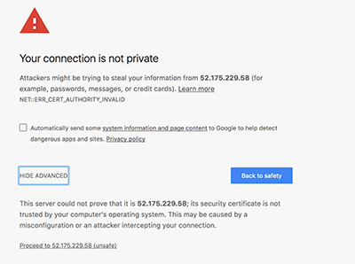
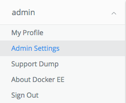
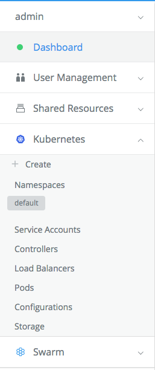
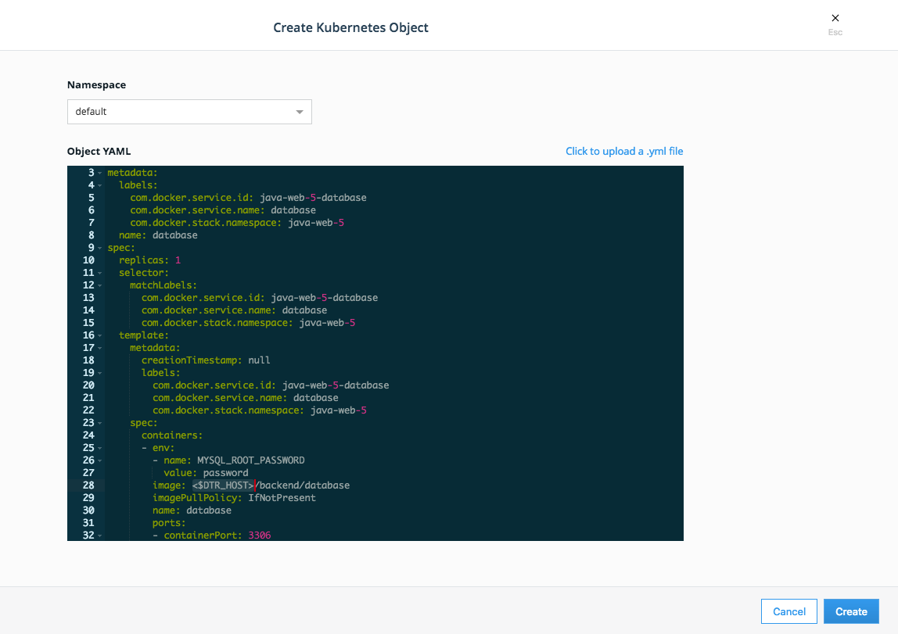
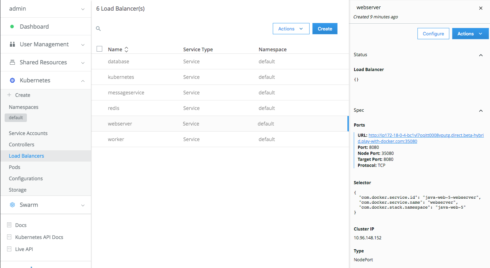
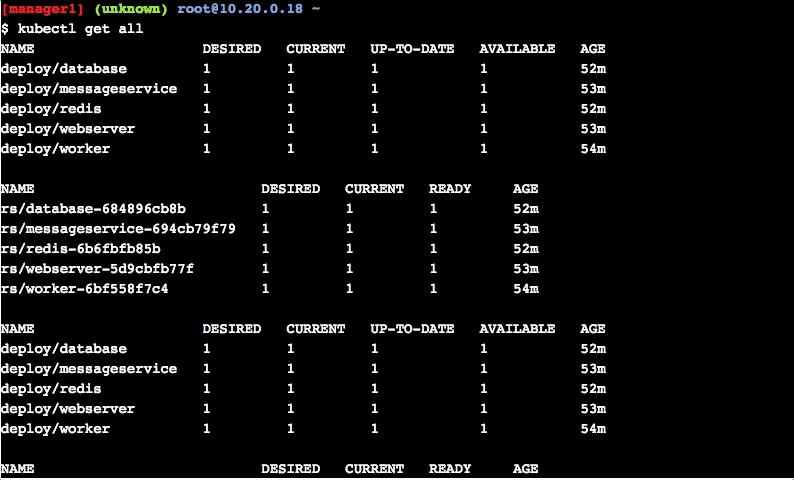

# Storage Workshop

Docker EE 2.0 is the first Containers-as-a-Service platform to offer production-level support for the integrated management and security of both Linux and Windows Server Containers. It is also the first platform to support both Docker Swarm and Kubernetes orchestration.

In this lab we'll look at the types of storage options that are available and how to implement them within a container environment

> **Difficulty**: Intermediate (assumes basic familiarity with Docker) If you're looking for a basic introduction to Docker, check out [https://training.play-with-docker.com](https://training.play-with-docker.com)

> **Time**: Approximately 75 minutes

> **Introduction**:
>	* [What is the Docker Platform](#intro1)
>	* [Overview of Orchestration](#intro2)
>		* [Basics of Docker Swarm mode](#intro2.1)
>		* [Basics of Kubernetes](#intro2.2)

> **Tasks**:

> * [Task 1: Configure the Docker EE Cluster](#task1)
>   * [Task 1.1: Accessing PWD](#task1.1)
>   * [Task 1.2: Configure Manager1](#task1.2)
>   * [Task 1.3: Configure Workers](#task1.3)
> * [Task 2: Local Docker Volume](#task2)
>   * [Task 2.1: Create a local Docker Volume](#task2.1)
>   * [Task 2.2: Create multiple containers that use the same volume](#task2.2)
>   * [Task 2.3: Create shared data](#task2.3)


## Understanding the Play With Docker Interface

# `https://dockr.ly/dc18workshop`


This workshop is only available to people in a pre-arranged workshop. That may happen through a [Docker Meetup](https://events.docker.com/chapters/), a conference workshop that is being led by someone who has made these arrangements, or special arrangements between Docker and your company. The workshop leader will provide you with the URL to a workshop environment that includes [Docker Enterprise Edition](https://www.docker.com/enterprise-edition). The environment will be based on [Play with Docker](https://labs.play-with-docker.com/).

If none of these apply to you, contact your local [Docker Meetup Chapter](https://events.docker.com/chapters/) and ask if there are any scheduled workshops. In the meantime, you may be interested in the labs available through the [Play with Docker Classroom](training.play-with-docker.com).

There are three main components to the Play With Docker (PWD) interface. 

### 1. Console Access
Play with Docker provides access to the 4 Docker EE hosts in your Cluster. These machines are:

* A Linux-based Docker EE 18.01 Manager node
* Three Linux-based Docker EE 18.01 Worker nodes

> **Important Note: beta** Please note, as of now, this is a Docker EE 2.0 environment. Docker EE 2.0 shows off the new Kubernetes functionality which is described below.

By clicking a name on the left, the console window will be connected to that node.

### 2. Access to your Universal Control Plane (UCP) and Docker Trusted Registry (DTR) servers

Additionally, the PWD screen provides you with a one-click access to the Universal Control Plane (UCP)
web-based management interface as well as the Docker Trusted Registry (DTR) web-based management interface. Clicking on either the `UCP` or `DTR` button will bring up the respective server web interface in a new tab.

### 3. Session Information

Throughout the lab you will be asked to provide either hostnames or login credentials that are unique to your environment. These are displayed for you at the bottom of the screen.

## Document conventions

- When you encounter a phrase in between `<` and `>`  you are meant to substitute in a different value.

	For instance if you see `<dtr hostname>` you would actually type something like `ip172-18-0-7-b70lttfic4qg008cvm90.direct.ee-workshop.play-with-docker.com`

## <a name="intro1"></a>Introduction

Docker EE provides an integrated, tested and certified platform for apps running on enterprise Linux or Windows operating systems and Cloud providers. Docker EE is tightly integrated to the the underlying infrastructure to provide a native, easy to install experience and an optimized Docker environment. Docker Certified Infrastructure, Containers and Plugins are exclusively available for Docker EE with cooperative support from Docker and the Certified Technology Partner.

### <a name="intro2"></a>Overview of Orchestration

While it is easy to run an application in isolation on a single machine, orchestration allows you to coordinate multiple machines to manage an application, with features like replication, encryption, loadbalancing, service discovery and more. If you've read anything about Docker, you have probably heard of Kubernetes and Docker swarm mode. Docker EE allows you to use either Docker Swarm mode or Kubernetes for orchestration.

Both Docker Swarm mode and Kubernetes are declarative: you declare your cluster's desired state, and applications you want to run and where, networks, and resources they can use. Docker EE simplifies this by taking common concepts and moving them to the a shared resource.

#### <a name="intro2.1"></a>Overview of Docker Swarm mode

A swarm is a group of machines that are running Docker and joined into a cluster. After that has happened, you continue to run the Docker commands you’re used to, but now they are executed on a cluster by a swarm manager. The machines in a swarm can be physical or virtual. After joining a swarm, they are referred to as nodes.

Swarm mode uses managers and workers to run your applications. Managers run the swarm cluster, making sure nodes can communicate with each other, allocate applications to different nodes, and handle a variety of other tasks in the cluster. Workers are there to provide extra capacity to your applications. In this workshop, you have one manager and three workers.

#### <a name="intro2.2"></a>Overview of Kubernetes

Kubernetes is available in Docker EE 2.0 and included in this workshop. Kubernetes deployments tend to be more complex than Docker Swarm, and there are many component types. UCP simplifies a lot of that, relying on Docker Swarm to handle shared resources. We'll concentrate on Services and Deployments in this workshop, but there's plenty more supported by UCP 2.0.

## <a name="task1"></a>Task 1: Configure the Docker EE Cluster

The Play with Docker (PWD) environment is almost completely set up, but before we can begin the labs, we need to do two more steps. One will be to apply configuration to the manager node so that it will provide shared storage, the second is to configure the workers so that they can mount shared storage.

### <a name="task 1.1"></a>Task 1.1: Accessing PWD

1. Navigate in your web browser to the URL the workshop organizer provided to you.

2. Fill out the form, and click `submit`. You will then be redirected to the PWD environment.

	It may take a few minutes to provision out your PWD environment.

	> In a production environment you would use certs from a trusted certificate authority and would not see this screen.
	>
	> 

3. Click the `UCP` button on the left side of the screen.

4. When prompted enter your username and password (these can be found below the console window in the main PWD screen). The UCP web interface should load up in your web browser.

	> **Note**: Once the main UCP screen loads you'll notice there is a red warning bar displayed at the top of the UCP screen, this is an artifact of running in a lab environment. A UCP server configured for a production environment would not display this warning
	>
	> 


### <a name="task 1.2"></a>Task 1.2: Configure Manager1

Select `Manager1` from the PWD UI and access the console interface.

Run the following command:

```
curl -L dockerdemo.it/managerEE | sh

```
    

### <a name="task 1.3"></a>Task 1.3: Configure Workers

Select `Worker1` from the PWD UI and access the console interface.

Run the following command:

```
curl -L dockerdemo.it/workerEE | sh

```
**Repeat** for the remaining workers.

## <a name="task2"></a>Task 2: Local Docker Volume

In this task we will create a Docker Volume that multiple containers can make use of within the same host, this work will be done on `worker1`.

### <a name="task 2.1"></a>Task 2.1: Create a local docker volume

In the UI select `worker1` and ensure that CLI is visible, the UI may need waking up with a few presses of the `return` key. 

Create a local volume with the following command:

```
docker volume create dockercon
```

We can check that this new volume has been created by looking through the list of docker volumes.

```
docker volume ls | grep dockercon
```

### <a name="task 2.2"></a>Task 2.2: Create multiple containers that use the same volume

The same node has been configured to have multiple sessions enabled through the `screen` utility. There is a `.screenrc` file that has this configuration already pre-configured. 

Start up the utility with the command `screen` and you'll be presented with a split screen and two command prompts.

> ctrl a-tab will switch between the two sessions

Start a new container in each of the sessions with the following command:

```
docker run -it --rm -v dockercon:/dockercon busybox
```

The above command will run the `busybox` container and map in the Docker volume `busybox` to the path `/dockercon` inside the container.

### <a name="task 2.3"></a>Task 2.3: Create shared data

In **Container 1** run the following command:

```
watch ls /dockercon
```
The above command will periodically (every 2 seconds) run the command `ls /dockercon` and print out the output.

In **Container 2** move to the docker mount with `cd /dockercon` and we will create simple files with the `touch` command. e.g.

```
touch sample_data
```

You will see these new files be reflected in the output of the first container.

### <a name="task 2.4"></a>Task 2.4: Local Volume cleanup


Once completing the task **both** containers will need exiting to close the screen session, after exiting the first session use `ctrl+a+tab` to move to the next session and exit. Finally remove the Docker volume with the command `docker volume rm dockercon`.

## <a name="task3"></a>Task 3: Share Storage across hosts

In this task we will create a Docker volume that can be accessed from multiple hosts in the cluster.

### <a name="task 3.1"></a>Task 3.1: Create a shared Docker volume

This task will require getting the IP address of `manager1` which should be displayed in the output from the initial setup task 1.2.

The following command will need modifying so that the address of manager1 is used, run on one of the **worker** nodes:

```
docker volume create                \
        --opt type=nfs                \
        --opt o=addr=10.20.0.XXX,rw   \
        --opt device=:/nfs            \
        nfs
```

The above command will create a Docker volume using NFS storage to allow multiple hosts access.

To examine the new volume we can `inspect` it with the following command:

```
docker volume inspect nfs
```

**Repeat this step on another worker node**

### <a name="task 3.2"></a>Task 3.2: Create multiple containers that use the same volume

Start a new container in each of two **worker** nodes with the following command:

```
docker run -it --rm -v nfs:/dockercon busybox
```

The above command will run the `busybox` container and map in the Docker volume `nfs` to the path `/dockercon` inside the container.

### <a name="task 3.3"></a>Task 2.3: Create shared data

In **Container 1** run the following command:

```
watch ls /dockercon
```
The above command will periodically (every 2 seconds) run the command `ls /dockercon` and print out the output.

In **Container 2** move to the docker mount with `cd /dockercon` and we will create simple files with the `touch` command. e.g.

```
touch sample_data
```

You will see these new files be reflected in the output of the first container.

### <a name="task 3.4"></a>Task 2.4: Local Volume cleanup


Once completing the task exit both of the containers and finally remove the Docker volume with the command `docker volume rm nfs`.

## <a name="task4"></a>Task 4: Storage Orchestration with Swarm

In Task 3 we created shared storage that could be accessed by multiple nodes in the same cluster, in this task we will have Swarm manage the creation of volumes and the mapping as container are scheduled on a node in the cluster.

### Number of Managers

The recommended number of managers for a production cluster is 3 or 5. A 3-manager cluster can tolerate the loss of one manager, and a 5-manager cluster can tolerate two instantaneous manager failures. Clusters with more managers can tolerate more manager failures, but adding more managers also increases the overhead of maintaining and committing cluster state in the Docker Swarm Raft quorum. In some circumstances, clusters with more managers (for example 5 or 7) may be slower (in terms of cluster-update latency and throughput) than a cluster with 3 managers and otherwise similar specs.

Managers in a production cluster should ideally have at least 16GB of RAM and 4 vCPUs. Testing done by Docker has shown that managers with 16GB RAM are not memory constrained, even in clusters with 100s of workers and many services, networks, and other metadata.

On production clusters, never run workloads on manager nodes. This is a configurable manager node setting in Docker Universal Control Plane (UCP).

### Worker Nodes Size and Count

For worker nodes, the overhead of Docker components and agents is not large — typically less than 1GB of memory. Deciding worker size and count can be done similar to how you currently size app or VM environments. For example, you can determine the app memory working set under load and factor in how many replicas you want for each app (for durability in case of task failure and/or for throughput). That will give you an idea of the total memory required across workers in the cluster.

By default, a container has no resource constraints and can use as much of a given resource as the host’s kernel scheduler allows. You can limit a container's access to memory and CPU resources. With the release of Java 10, containers running the Java Virtual Machine will comply with the limits set by Docker.

## <a name="task4.1"></a>Task 4.1: Configure Workloads to Only Run on Workers 

*OPTIONAL FOR THE WORKSHOP*

Click on `Admin` > `Admin Settings` in the left menu sidebar.



Click on `Scheduler` and under `Container Scheduling` uncheck the first option `Allow administrators to deploy containers on UCP managers or nodes running DTR`

## <a name="task4.2"></a>Task 4.2: Configuring Containers for Deployment

We'll use the Redis container as example on how to configure containers for production and go through the options.

```yaml
  redis:
    image: redis
    deploy:
      mode: replicated
      replicas: 3
    resources:
      limits:
        cpus: '0.5'
        memory: 50M
      reservations:
        cpus: '0.25'
        memory: 20M
    placement:
        constraints: [node.role == worker]
    restart_policy:
      condition: on-failure
      delay: 5s
      max_attempts: 3s
      window: 120s
    update_config:
          parallelism: 2
          delay: 10s
    ports:
      - "6379:6379"
    networks:
      - back-tier
```
### Deploy

The deploy directive sets the `mode` to either `global` which is one container per node or `replicated` which specifies the number of containers with the `replicas` parameters. The example launches 3 Redis containers.

### Resources

The `resources` directive sets the `limits` on the memory and CPU available to the container. `Reservations` ensures that the specified amount will always be available to the container.

### Placement

Placement specifies constraints and preferences for a container. Constraints let you specify which nodes where a task can be scheduled. For example, you can specify that a container run only on a worker node, as in the example. Other contraints are:

|node | attribute matches | example|
|-----|-------------------|--------|
|node.id | Node ID | node.id==2ivku8v2gvtg4 |
|node.hostname | Node hostname | node.hostname!=node-2|
|node.role | Node role | node.role==manager |
|node.labels |user defined node labels | node.labels.security==high|
|engine.labels |Docker Engine's labels	|engine.labels.operatingsystem==ubuntu 14.04 |

Preferences divide tasks evenly over different categories of nodes. One example of where this can be useful is to balance tasks over a set of datacenters or availability zones. For example, consider the following set of nodes:

* Three nodes with node.labels.datacenter=east
* Two nodes with node.labels.datacenter=south
* One node with node.labels.datacenter=west

Since we are spreading over the values of the datacenter label and the service has 9 replicas, 3 replicas will end up in each datacenter. There are three nodes associated with the value east, so each one will get one of the three replicas reserved for this value. There are two nodes with the value south, and the three replicas for this value will be divided between them, with one receiving two replicas and another receiving just one. Finally, west has a single node that will get all three replicas reserved for west.

### Restart Policy

Restart_policy configures if and how to restart containers when they exit. restart.

* `condition`: One of none, on-failure or any (default: any).
* `delay`: How long to wait between restart attempts, specified as a duration (default: 0).
* `max_attempts`: How many times to attempt to restart a container before giving up (default: never give up).
* `window`: How long to wait before deciding if a restart has succeeded, specified as a duration (default: decide immediately).

### Update Config

Update_config configures how the service should be updated. Useful for configuring rolling updates.

* `parallelism`: The number of containers to update at a time.
* `delay`: The time to wait between updating a group of containers.
* `failure_action`: What to do if an update fails. One of continue, rollback, or pause (default: pause).
* `monitor`: Duration after each task update to monitor for failure (ns|us|ms|s|m|h) (default 0s).
* `max_failure_ratio`: Failure rate to tolerate during an update.
* `order`: Order of operations during updates. One of stop-first (old task is stopped before starting new one), or start-first (new task is started first, and the running tasks briefly overlap) (default stop-first)

## <a name="task4.3"></a>Task 4.3: Deploying a service that uses shared storage

Deploy the application as an application stack in Docker EE, the `manager1` will need replacing with the IP address that should be displayed in the UI.

```yaml
version: "3.3"

services:
  http:
    image: nginx:latest
    deploy:
      replicas: 4
    ports:
      - "8080:80"
    volumes:
      - type: volume
        source: nfs
        target: /usr/share/nginx/html
        volume:
          nocopy: true
volumes:
  nfs:
    driver_opts:
      type: "nfs"
      o: "addr=<manager1>,nolock,soft,rw"
      device: ":/nfs"
```

This will create four nginx replicas that will all attempt to read web assets from the path `/usr/share/nginx/html` however as this is empty we should be returned a `403` error.

## <a name="task4.4"></a>Task 4.4: Create a shared web asset

On one of the nodes find the swarm created volume with the `docker volume ls` command.

Run a new container and map the shared volume
```
docker run -it --rm -v <swarm_volume>:/web busybox
```

Create a new `index.html` with the following command

```
echo "
<head>
<body>
WELCOME TO DOCKERCON
</body>
</head
" > index.html
```

Refreshing the browser should reflect this change.

## <a name="task4.5"></a>Task 4.5: Visualize the Deployment

**OPTIONAL**

We can use the Docker Swarm visualizer to see the deployment graphically. To do this, go back to the master node terminal and run:

```bash
docker run -it -d -p 3000:8080 -v /var/run/docker.sock:/var/run/docker.sock dockersamples/visualizer
```

In your browser, go to http://<$UCP_HOST>:3000 to see the containers and how they are distributed across the cluster.


## <a name="task5"></a>Task 5: Deploying in Kubernetes

Docker EE gives you the choice of which orchestrator that you want to use. The same application that you deployed in Docker Swarm can be deployed in Kubernetes using a Docker Compose file or with Kubernetes manifests.

### <a name="task5.1"></a>Task 5.1: Configure Terminal

Kubernetes is an API and to connect to the API using the command line we will need to configure the terminal. This is done with a client bundle which contains the certificates to authenticate against the Kubernetes API.

We can download the client bundle from UCP by requesting an authentication token.

```bash
PAYLOAD="{\"username\": \"admin\", \"password\": \"admin1234\"}"

echo $PAYLOAD
{"username": "admin", "password": "admin1234"}

TOKEN=$(curl --insecure  -d "$PAYLOAD" -X POST https://localhost/auth/login  | jq -r ".auth_token")

% Total    % Received % Xferd  Average Speed   Time    Time     Time  Current
                                 Dload  Upload   Total   Spent    Left  Speed
100   100  100    54  100    46    102     87 --:--:-- --:--:-- --:--:--   103

echo $TOKEN

211845cb-7751-4582-b880-f59252f61e18
```

Once we have a token, we can use it to get a client bundle and use it to configure the environment.

```bash
curl -k -H "Authorization: Bearer $TOKEN" https://localhost/api/clientbundle > /tmp/bundle.zip

mkdir /tmp/certs-$TOKEN

pushd /tmp/certs-$TOKEN

unzip /tmp/bundle.zip

rm /tmp/bundle.zip

source /tmp/certs-$TOKEN/env.sh

popd
```

Test that the kubectl can connect to kubernetes.

```bash
$ kubectl get all
NAME             TYPE        CLUSTER-IP   EXTERNAL-IP   PORT(S)   AGE
svc/kubernetes   ClusterIP   10.96.0.1    <none>        443/TCP   6h
```  

### <a name="task5.2"></a>Task 5.2: Deploy Application in Kubernetes

It's beyond the scope of this tutorial to cover kubernetes indepth. However, if you're unfamiliar with kubernetes, here are some basic concepts.

Kubernetes uses abstractions to represent containerized workloads and their deployment. These abstractions are represented by objects and two of the basic objects are `pods` and `services`.

`Pods` are a single unit of deployment or a single application in kubernetes that may have or more containers. Pods are mortal which means that when they are destroyed they do not return. This means that pods do not have a stable IP. In order for a deployment that uses multiple pods that rely on each other, Kubernetes has `services` which defines a set of pods and a policy that defines how they are available.

Beyond basic objects, such as pods and services, is a higher level of abstraction called `controllers` that build on the basic objects to add functions and convenience features. A `replicaset` is a controller that creates and destroys pods dynamically. Another controller and higher level of abstraction is a `deployment` which provides the declarative updates for `pods` and `replicasets`. Deployments describe the desired end state of an application.


1. Click on `Kubernetes` on the side bar menu and click `Storage`



2. Paste the following configuration for a Persistent volume

```yaml
apiVersion: v1
kind: PersistentVolume
metadata:
  name: nfs-pv 
spec:
  capacity:
    storage: 1Gi 
  accessModes:
    - ReadWriteMany 
  persistentVolumeReclaimPolicy: Retain 
  nfs: 
    path: /nfs 
    server: 10.20.0.XXX 
    readOnly: false
```

Ensure the `server` has the address of manager1.



3. Create a Persistent Volume claim

```yaml
apiVersion: v1
kind: PersistentVolumeClaim
metadata:
  name: nfs-pvc  
spec:
  accessModes:
  - ReadWriteMany      
  resources:
     requests:
       storage: 1Gi
```

4. Create a web service

```yaml
apiVersion: apps/v1beta2
kind: Deployment
metadata:
  name: nginx-deployment
spec:
  selector:
    matchLabels:
      app: nginx
  replicas: 1
  template:
    metadata:
      labels:
        app: nginx
    spec:
      containers:
      - name: nginx
        image: nginx:1.7.9
        ports:
        - containerPort: 80
        volumeMounts:
          - name: nfsvol 
            mountPath: /usr/share/nginx/html 
      volumes:
        - name: nfsvol
          persistentVolumeClaim:
            claimName: nfs-pvc
---
apiVersion: v1
kind: Service
metadata:
  name: nginx
  labels:
    app: nginx
spec:
  type: NodePort
  ports:
    - port: 80
      nodePort: 32768
  selector:
    app: nginx
```


5. To see the application running, click on `Load Balancers` on the left side menu, click on `nginx` to display the webserver panel. Under `Ports` you'll see the URL for the application. Click on the link and add `nginx` to the url to get to the application.



Note that the port number is different from the common port 80 used by Nginx. The webserver spec uses Kubernetes' `NodePort` publishing service which uses a predefined range of ports such as 32768. To use a different IP address or port outside the the range defined by nodePort, we can configure a pod as a proxy.

###  <a name="task5.3"></a>Task 5.3: Check out the Deployment on the Command Line

1. Go to the terminal window.

2. View all info on deployment:

```bash
$ kubectl get all
```


3. View info on pods

```bash
$ kubectl get pods
```


4. View info on services

```bash
$ kubectl get services
```


5. View info on deployments

```bash
$ kubectl get deployments
```


## Conclusion


### What we covered

We started with basic N-Tier monolithic application composed of a Java application and a relational database. As a first step, we first deployed the application as-is to see how it would run in a containerized environment.

The next step was to determine if any parts of the application could be refactored to make it more scalable. One factor that affects application performance is multiple writes to the database. To address this bottleneck, we implemented a message service that writes the user data to Redis, a key-value data store, to hold the data until a worker service writes it the the database. The messaging queue was implemented with REST interface and we modified the Java app to send the data to the message service.

Implementing the message service opened up possibilities for adding new functions such as monitoring and visualization of the user data. We added Elasticsearch and Kibana containers to the stack and produced a visualization just by adding these services to the Docker Compose file.

In the following section, we looked at how to configure the application to deploy in a production environment by adding parameters that scaled and configured the services appropriately. We used another container to visualize the deployment across multiple containers.

In the final section, we changed the orchestrator from Docker Swarm to Kubernetes and deployed the application using Kubernetes. From the command line we queried the Kubernetes API about resources we deployed. We also were able to the same tasks using the Docker EE interface.

### Modernization Workflow

The modernization workflow is based on whether the application is whether the application is at the end of life or if the application will continue on as a business process. If the application is at the end of life, containerizing the application components might be sufficient for maintenance. Minor changes and patches can be rolled in as needed until the application is no longer needed. Section 2 of this tutorial covered the process of containerizing an existing application.

If the application is an ongoing business process, then piece wise modernization of the application is possible. Section 3 of this workshop covers how to take one aspect of an application and modernize the architecture. Section 4 covered how we can add new services because we extedend the architecture. Section 5 described how to configure an application for a production deployment using Swarm. The final section, showed how to deploy the same application using Kubernetes as an orchestrator. With Docker EE you have choice on how to deploy your application as well as environment to debug, monitor and manage your applications.

### Agility

In this tutorial we saw how easy it was to convert typical N-Tier Java CRUD application to containers and run them as an application in Docker EE. Tools such as multi-stage builds, Docker files, Docker Trusted Registry and Docker compose simplified the process of build, ship and run. We could also reuse components such as the database when modernizing the application and we could incorporate new capabilities such as monitoring and visualization with minor changes to the application. Docker EE provides a comprehensive platform for building, modernizing and deploying applications on cloud infrastructure.

### Choice

With Docker EE you have a choice. Whether your app is tied to a specific version of Java or you're building on the latest JVM, there are base images for application specific requirements. EE also supports Windows containers so you can run hybrid workloads to take advantage of both Windows and Linux applications. Docker EE supports both Docker Swarm and Kubernetes, you can pick the right solution for the application with out lock in.


## Call to Action

### Download Docker EE
### MTA
### Docker Associate Certification
